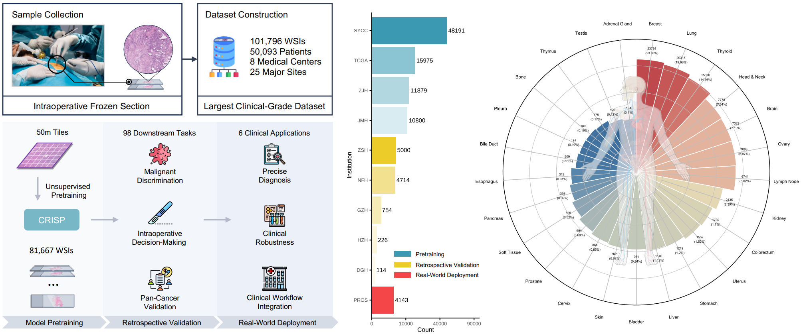
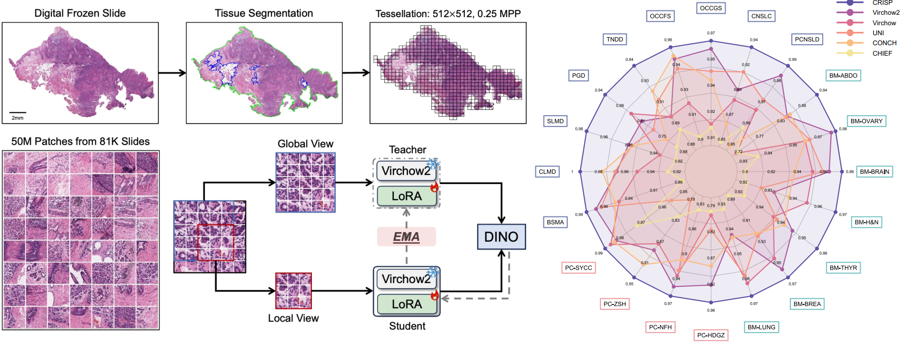
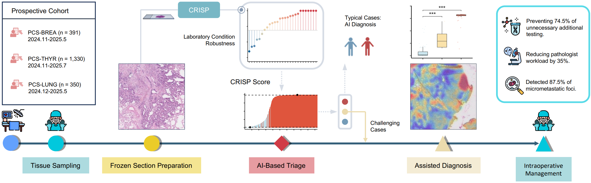

# CRISP: A Clinical-Grade Universal Foundation Model for Intraoperative Pathology

[](https://arxiv.org/abs/2510.04861) [](#reference)

**CRISP** (Clinical-grade Robust Intraoperative Support for Pathology) is a universal foundation model designed for intraoperative frozen section analysis. Developed on over 100,000 frozen sections from eight medical centers, CRISP provides robust and generalizable diagnostic support across a wide range of tumor types, anatomical sites, and clinical scenarios.

## 📖 Overview
Intraoperative pathology plays a critical role in precision surgery, yet it faces challenges such as diagnostic complexity and limited high-quality frozen-section data. CRISP addresses these issues by leveraging a large-scale, multi-center frozen section dataset to deliver:

- **High diagnostic accuracy** across benign–malignant discrimination, key intraoperative decision-making, and pan-cancer detection
- **Strong generalization** to unseen anatomical sites and rare cancers
- **Prospective clinical validation** with real-world impact on surgical decisions

In a prospective cohort of over 2,000 patients, CRISP informed surgical decisions in **92.6% of cases**, reduced diagnostic workload by **35%**, and improved micrometastasis detection with **87.5% accuracy**.



## 🪧 TODO
- [x] *Release manuscript*
- [x] *Release source code of downstream tasks*
- [x] *Release [model weights](https://drive.google.com/file/d/1Fr83wGydqFN80r5fTq1UL06vmL-xkw3F/view?usp=sharing) of CRISP*

## 🚀 Quick Start

CRISP require following dependencies:
- Python >= 3.13.5
- PyTorch >= 2.8.0
- timm >= 1.0.16
- torchvision >= 0.22.1
- peft >= 0.15.2
- numpy >= 2.2.6
- pillow >= 11.3.0

To utilize the CRISP model, you need to download the [model weights](https://drive.google.com/file/d/1Fr83wGydqFN80r5fTq1UL06vmL-xkw3F/view?usp=sharing) first. Then, the generalizable features for intraoperative pathology can be extracted as follows:

```python
import numpy as np
from PIL import Image
from codes.feature_extraction.crisp import get_trans, get_model

# build model and transforms
device = torch.device("cuda" if torch.cuda.is_available() else "cpu")
ckpt_path = "YOUR_PATH_TO_MODEL/CRISP.pth"  # please download the model weights first
trans = get_trans()
model = get_model(device, ckpt_path)
# dummy input
img = Image.fromarray((np.random.rand(224, 224, 3) * 255).astype(np.uint8))
img = img.convert("RGB")
# feature extraction
img = trans(img).unsqueeze(0).to(device)
print('input image shape:', img.shape)
feature = model(img)
print('output feature shape:', feature.shape)
```

```shell
>>> input image shape: torch.Size([1, 3, 224, 224])
>>> output feature shape: torch.Size([1, 2560])
```

## 🏥 Key Features

- **Foundation Model Pretraining**: Trained on 50 million image patches from 25 anatomical sites
- **Multi-Task Support**: Supports nearly 100 diagnostic tasks including:
  - Benign vs. malignant classification
  - Intraoperative decision guidance
  - Pan-cancer detection
- **Multi-Center Robustness**: Validated across eight independent medical centers
- **Human-AI Collaboration**: Designed to assist pathologists in real-time surgical workflows


## 🎯 Clinical Impact

### Retrospective Evaluation
- **>15,000 slides** across ~100 diagnostic tasks
- Robust performance across diverse institutions, tumor types, and anatomical sites
- Effective generalization to previously unseen sites and rare cancers



### Prospective Validation
- **>2,000 patients** in real-world surgical workflows
- **92.6%** of cases directly informed surgical decisions
- **35% reduction** in diagnostic workload
- **87.5% accuracy** in micrometastasis detection
- Avoided **105 ancillary tests** through improved diagnostic accuracy


---

## 📊 Performance Summary

| Metric | Performance |
|--------|-------------|
| Surgical decision support | 92.6% of cases |
| Diagnostic workload reduction | 35% |
| Micrometastasis detection | 87.5% accuracy |
| Ancillary tests avoided | 105 |
| Generalization | Across unseen sites and rare cancers |

---

## 👥 Authors

**Equal Contribution**:

- **Zihan Zhao**  
    - Email: zhaozh2@sysucc.org.cn
    - Institution: Sun Yat-sen University Cancer Center

- **Fengtao Zhou**  
    - Email: fzhouaf@connect.ust.hk 
    - Institution: The Hong Kong University of Science and Technology

- **Ronggang Li**  
    - Email: lrg760904@163.com  
    - Institution: Jiangmen Central Hospital

[📧](mailto:fzhouaf@connect.ust.hk) **If you have any questions, feel free to contact us.**
---

## <a id="reference"></a>🤝 Reference
**If you find our work useful in your research, please consider citing our paper.**

Zhao Z, Zhou F, Li R, et al. A Clinical-grade Universal Foundation Model for Intraoperative Pathology[J]. arXiv preprint arXiv:2510.04861, 2025.

```
@article{zhao2025clinical,
  title={A Clinical-grade Universal Foundation Model for Intraoperative Pathology},
  author={Zhao, Zihan and Zhou, Fengtao and Li, Ronggang and Chu, Bing and Zhang, Xinke and Zheng, Xueyi and Zheng, Ke and Wen, Xiaobo and Ma, Jiabo and Wang, Yihui and others},
  journal={arXiv preprint arXiv:2510.04861},
  year={2025}
}
```
